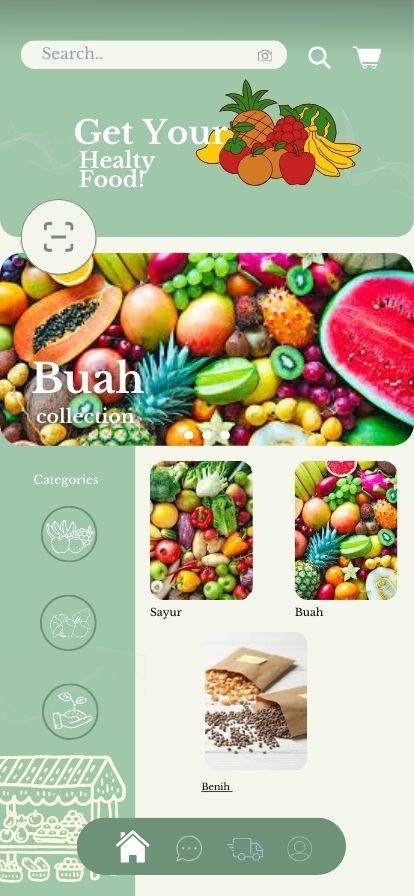
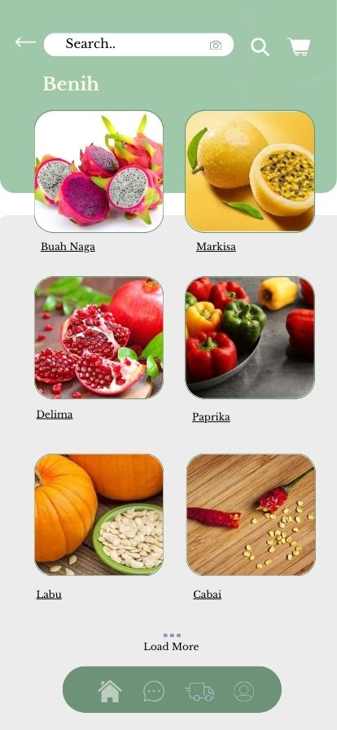
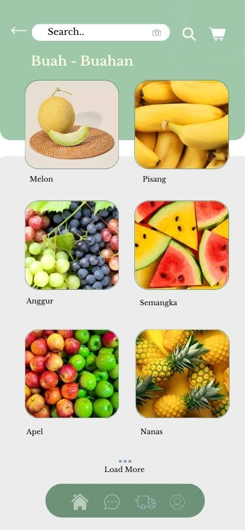
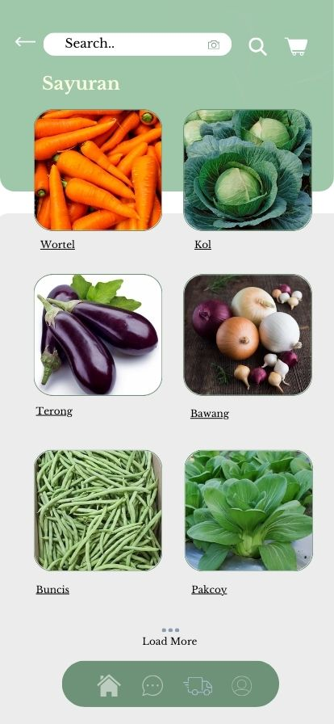

# Desain-Rumah-Panen-Segar-

## 📸 Tampilan Desain

Beberapa tangkapan layar tersedia di folder [`gambar-desain`](./gambar-desain):

- 
- 
- 
- 

---

## 🔗 Link Desain Interaktif Canva

- [Lihat Desain di Canva](https://www.canva.com/design/DAGlt2zK-FM/p3DFKguNCTFwnaICiA9NSw/edit?utm_content=DAGlt2zK-FM&utm_campaign=designshare&utm_medium=link2&utm_source=sharebutton)

## 🧾 Deskripsi

- Tools: Canva
- Nama Proyek: Rumah Panen Segar
- Tujuan: Mendesain antarmuka pengguna (UI/UX) untuk e-commerce sayur & buah
- Fitur utama: Beranda, daftar produk, checkout, detail produk
